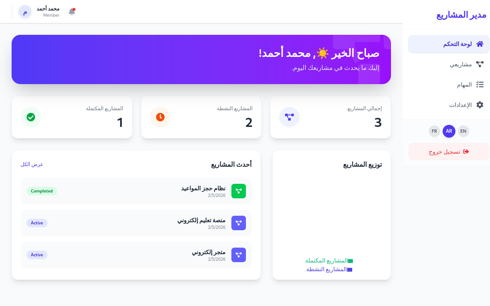
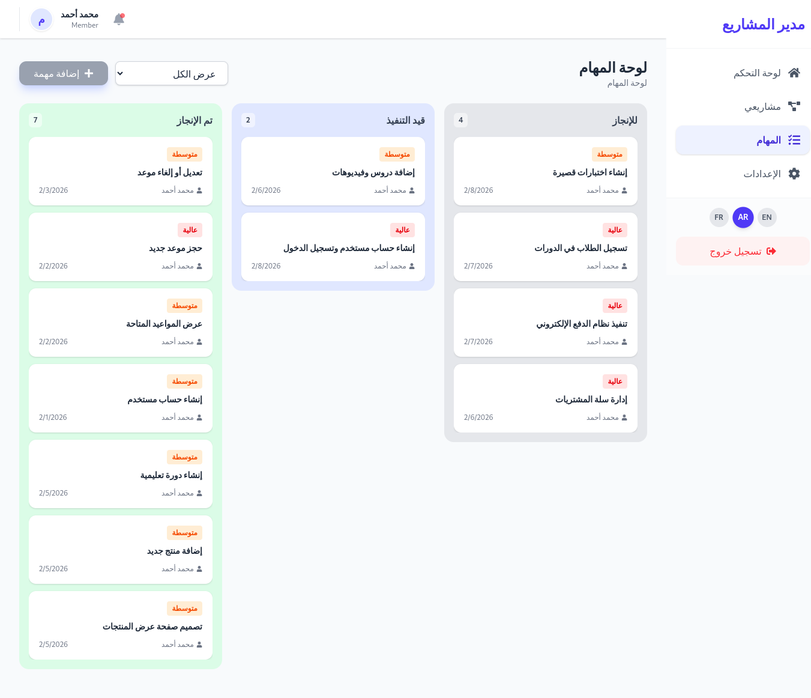
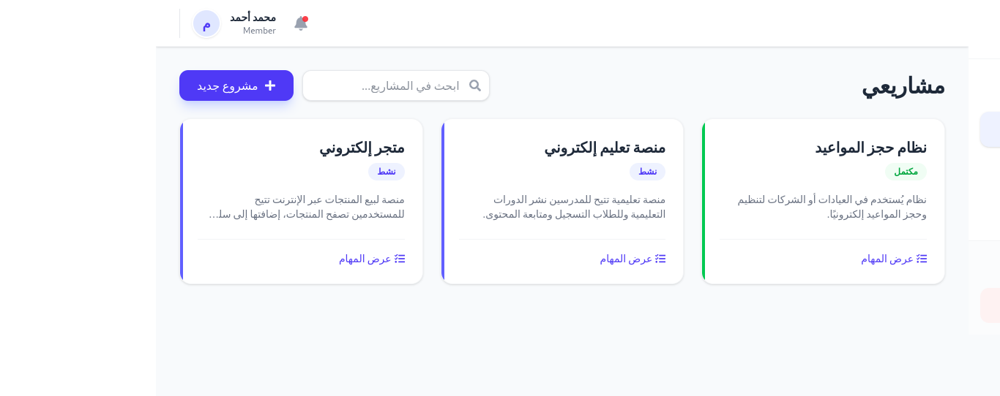
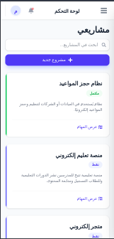
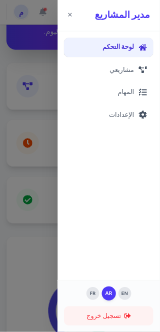
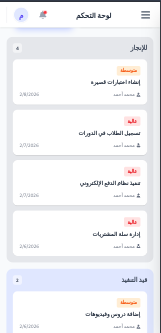
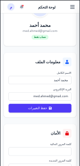

# 🚀 Project Management System (MERN Stack)


## 📋 Overview

A full-stack Project Management System (SaaS) built with modern MERN technologies. Enables users to create projects, manage tasks through an interactive Kanban board, with complete multi-language support (Arabic, English, French) and a responsive, beautiful user interface.

## ✨ Key Features

- 🎨 **Modern Design:** Attractive UI using Tailwind CSS & Framer Motion animations
- 🌍 **Multi-language Support:** Full support for Arabic, English, and French with RTL/LTR
- 📊 **Analytics Dashboard:** Charts using Recharts for project statistics
- 🎯 **Interactive Kanban Board:** Drag & Drop task management with smooth animations
- 🔐 **Robust Authentication:** Login, logout, profile management, and password change
- 📱 **Fully Responsive:** Works efficiently on all devices (desktop, tablet, mobile)

## 🛠️ Tech Stack

### Frontend:
- **React 19 & Vite**
- **Tailwind CSS** (Styling)
- **Framer Motion** (Animations)
- **Recharts** (Charts)
- **React Router Dom** (Routing)
- **i18next** (Localization)
- **Axios** (HTTP Client)
- **React Beautiful DND** (via @hello-pangea/dnd)

### Backend:
- **Node.js & Express**
- **MongoDB & Mongoose**
- **JWT** (Authentication)
- **Bcrypt** (Password Hashing)
- **dotenv** (Environment Variables)

## 🚀 Installation & Setup

### 1. Clone the Repository
```bash
git clone https://github.com/YOUR_USERNAME/project-management-system.git
cd project-management-system
```

### 2. Backend Setup
```bash
cd backend
npm install
```

Create `.env` file in backend folder:
```env
PORT=5000
MONGO_URI=mongodb+srv://your_mongodb_connection_string
JWT_SECRET=your_secret_key_here
JWT_EXPIRE=30d
NODE_ENV=development
```

Run backend:
```bash
npm run dev
```

### 3. Frontend Setup
```bash
cd frontend
npm install
```

Create `.env` file in frontend folder:
```env
VITE_API_URL=http://localhost:5000/api
```

Run frontend:
```bash
npm run dev
```

## 📸 Screenshots

### Dashboard


### Kanban Board


### Projects List


### Mobile Responsive





## 🌐 Live Demo

[Live Demo Link](https://project-management-system-onyc.vercel.app/)

## 👨‍💻 Author

**Abdallahi Nah**
- GitHub: [@Abdallahi-Nah](https://github.com/Abdallahi-Nah)
- LinkedIn: [My LinkedIn](https://linkedin.com/in/abdallahi-nah)

## 📄 License

This project is open source and available under the [MIT License](LICENSE).

## 🙏 Acknowledgments

Built with dedication as part of my portfolio to showcase full-stack development skills.

---

⭐ If you found this project helpful, please give it a star!
